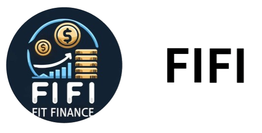
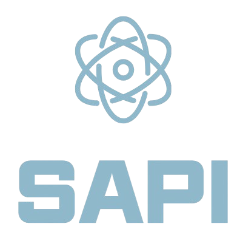

# Park Jun Yeong
Hello, there!

:mailbox: : psw9502@naver.com

## :cherry_blossom: SKill

## :page_with_curl: Portfolio

| Title | Develop Period | Content | Link |
|---|---|---|---|
| FIFI | 24.05.15 ~ 24.05.24 | 웹 환경 기반 은행 상품 추천 서비스 |  |
| 자율주행 시뮬레이션 | 24.05.24 ~ 24.07.04 | 자율주행 대회 우승 코드 회고록 (+ 작성 코드 고찰) |  |
| DayLog      | 24.07.08 ~ 24.08.16 | 연인들이 영상통화 중 나눈 대화의 하이라이트를 핫클립으로 생성하고, 추억을 관리하는 앱 |  |
| Hello, Word | 24.08.19 ~ 24.10.11 | 영유아를 위한 단어 학습 앱 |  |
| SAPI        | 24.10.14 ~ 24.11.19 | 개발자들을 위한 API 개발 통합 관리 시스템 |  |
